# 1. Product introduction

**KS0356 keyestudio Micro:bit Mini Smart Robot Car**

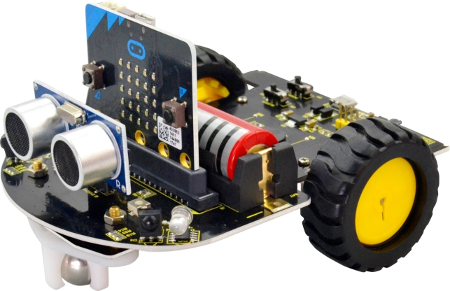

## 1.1 Product Description

Here comes the educational robot based on Micro:bit programming. Micro: bit is an ARM structure microcontroller designed by BBC. It is only half size of a credit card, onboard comes with Bluetooth, accelerometer, compass, three buttons, 5x5 LED matrix, mainly used for teens programming education.

The Micro:bit Mini Smart Robot Car integrates ultrasonic and infrared obstacle avoidance as well as line following. Also comes with a passive buzzer for playing music. Moreover, supply the power by 18650 batteries, supporting charge when run out of power. You will be able to adjust the motor speed.

This micro:bit robot is a perfect toy for kids to start learning robotics. The plug-and-play allow children to quickly learn graphic programming in entertaining, nurturing children's interest in science and logical thinking.

Note: **we adopt V1.5 micro:bit in the whole tutorial, but our tutorial is also compatible with the latest version micro:bit.** When doing experiment with latest micro:bit, you need to transfer code into Makecode online editor first, save code again then download it to micro:bit.

## 1.2 Specifications

- Voltage: 4.2-5.5V
- Current: USB power supply or power supply with a capacity greater than or equal to 1A
- Maximum power: maximum output power is 5W
- Operating temperature range: 0-50 degrees Celsius
- Dimensions: 120 * 90.7mm
- Environmental attributes: ROHS

## 1.3 Packing List

| No.  | Item                                                         | Quantity | Picture              |
| ---- | ------------------------------------------------------------ | -------- | -------------------- |
| 1    | Micro:bit main board                                         | 1        | 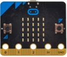  |
| 2    | keyestudio Micro:bit smart robot shield (Black and Eco-friendly) | 1        | 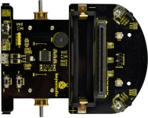  |
| 3    | Keyestudio line tracking sensor (Black and Eco-friendly)     | 1        | 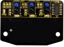  |
| 4    | HC-SR04 ultrasonic sensor                                    | 1        | 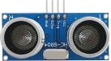  |
| 5    | JST PH2.0MM-5PIN double-head cable length 55MM               | 1        | 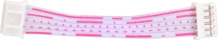  |
| 6    | W420 steel universal wheel                                   | 1        | 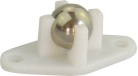  |
| 7    | 18650 red battery 3500mah (self prepare)                     | 1        | 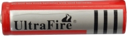  |
| 8    | N20 motor wheel diameter:43mm; width: 19mm ; hole diameter: 3mm type D ABS plastic + rubber yellow | 2        | 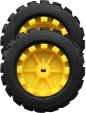  |
| 9    | M3 Nickel plated nut                                         | 2        | 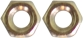 |
| 10   | Single pass M3*6mm+6mm  hex copper pillar                    | 2        | 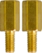 |
| 11   | M3*6MM round-head screw                                      | 2        | 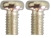 |
| 12   | yellow-black handle 3*40MM phillips screwdriver              | 1        | 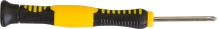 |
| 13   | USB cable A/MICRO OD: 4.0 Black with magnetic spring L=1.2m Eco-friendly | 1        | 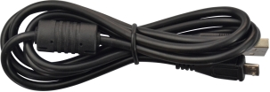 |