# 2. Product installation

a. Firstly prepare all the assembly components. Place them together before install the micro:bit robot car.

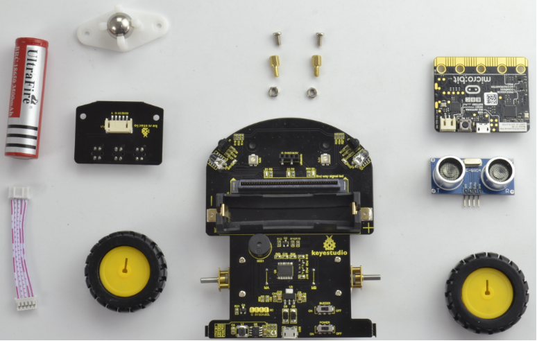

b. The first step should mount 2pcs hex copper pillar and 2pcs M3 Nickel plated nut on the front of car shield.

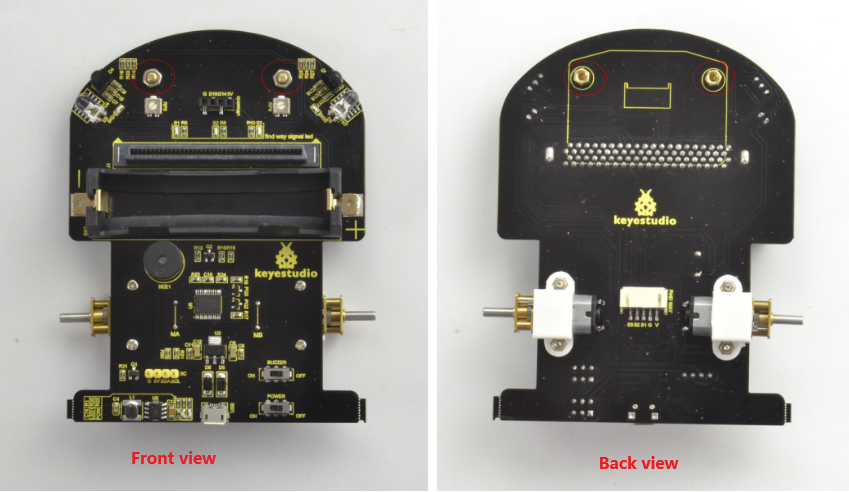

c. Connect the JST PH2.0MM-5PIN double-head cable to line tracking sensor. 

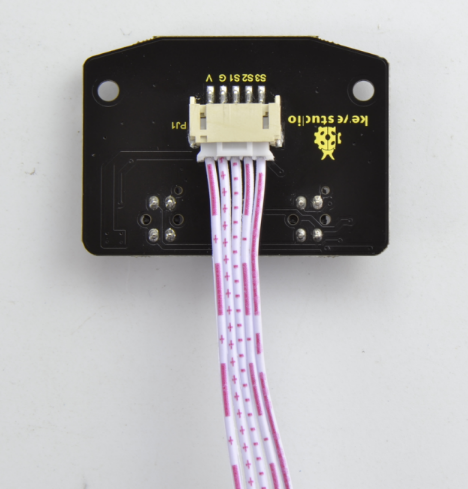

d. Then fix the line tracking sensor and W420 steel universal wheel onto the hex copper pillar on the car shield using 2pcs M3*6MM round-head screws.  

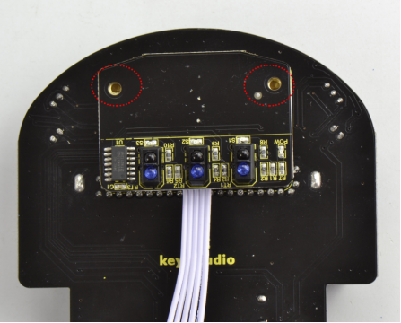

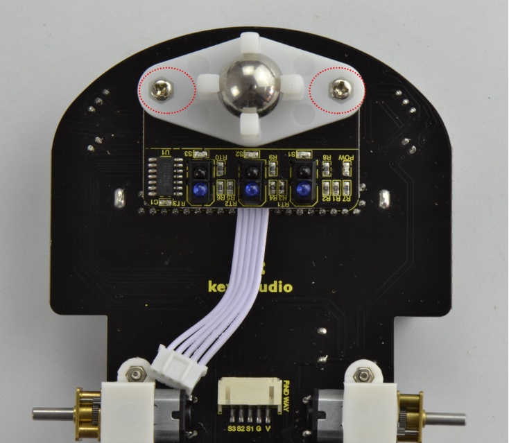

e. After that, mount the 2pcs N20 motor wheels into the DC motor.

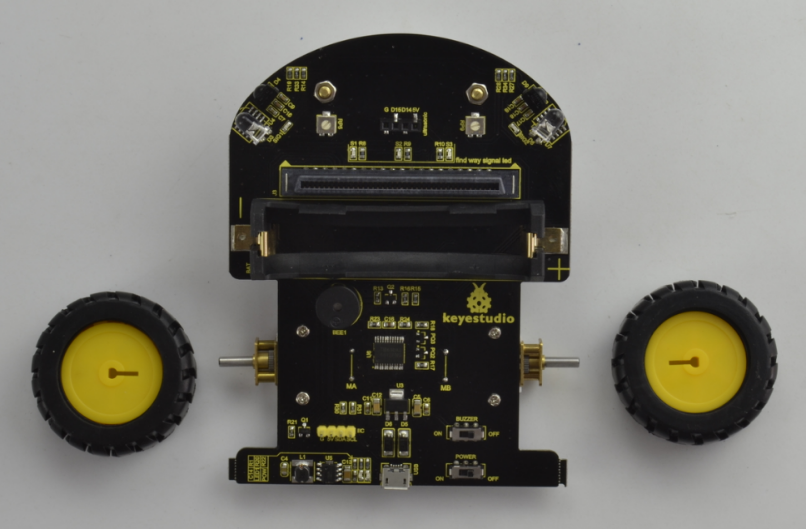

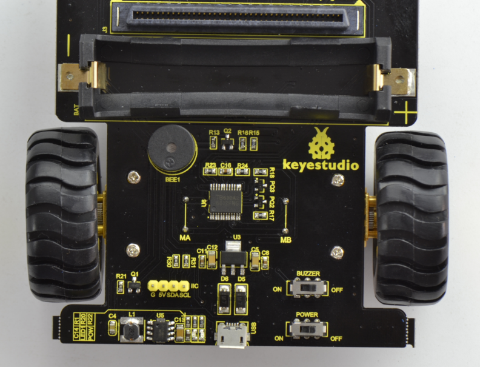

f. Now, we insert the ultrasonic sensor and micro:bit main board into the car shield.

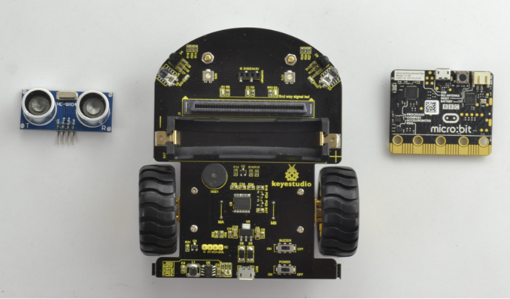

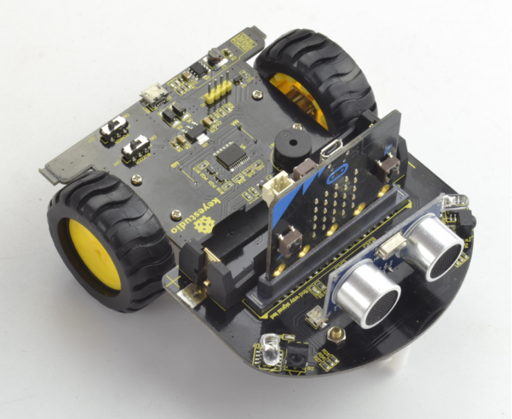

g. Connect the JST PH2.0MM-5PIN cable connected to line tracking sensor to the car shield.

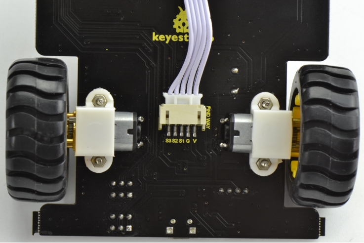

h. Finally, insert the 18650 battery into the car shield.

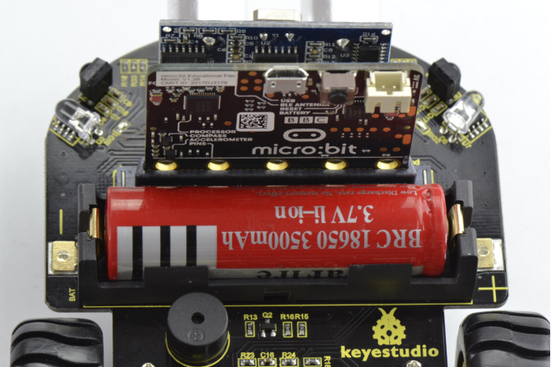

i. Congrats! The mini micro:bit robot car is installed well. Pretty simple. 