# 3. micro bit

**Download Code：  [Code](./Code.7z)**

## 3.1 micro:bit Example Use

**Step 1: Connect It**

Connect the micro:bit to your computer via a micro USB cable. 

Your micro:bit will show up on your computer as a drive called 'micro:bit'. 

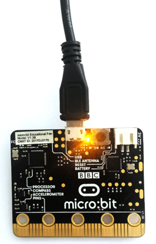

**Step 2: Program It**

Use micro:bit MakeCode Block editor [https://makecode.micro:bit.org/](https://makecode.microbit.org/) to write your first micro:bit code. 

You can drag and drop some example blocks and try your program on the Blocks Editor. Shown below. 

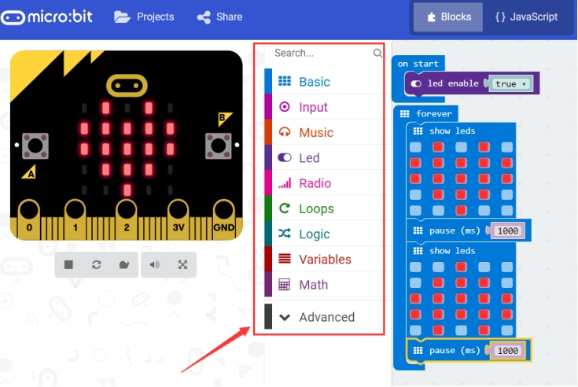

Click the JavaScript, you can see the corresponding program code. Shown as below figure.

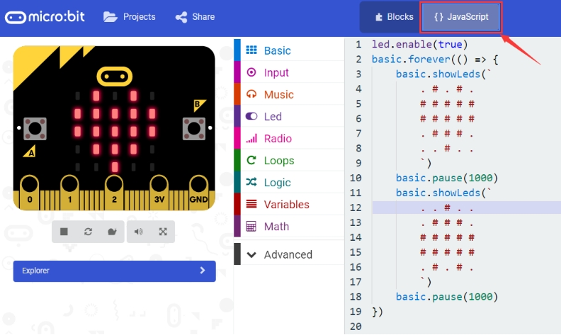

**Step 3: Download It**

Click the Download button in the editor. This will download a 'hex' file, which is a compact format of your program that your micro:bit can read. 

Here you can name the project as LED1, then click “Save”. Shown below.

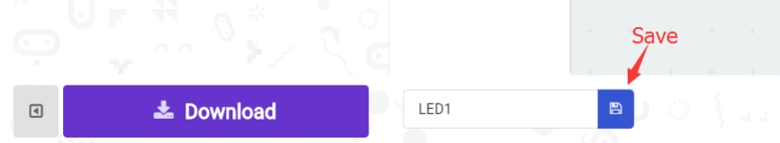

Once the hex file has downloaded, copy it to your micro:bit just like copying a file to a USB drive. On Windows find the microbit-LED1 file, you can right click and choose "Send To→MICROBIT."

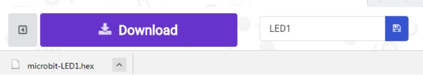

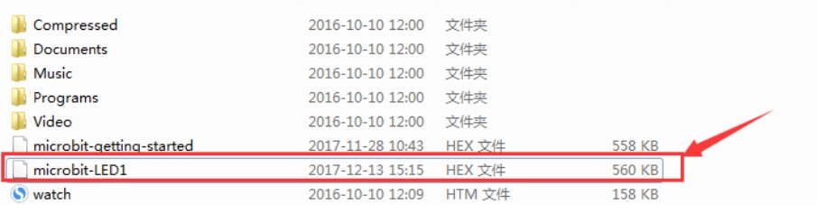

**Step 4: Play It**

The micro:bit will pause and the yellow 5*5 LED on the back of the micro:bit will display the images while your code is programmed. 

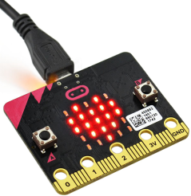

You can power it using USB cable or battery. The battery holder should connect two 1.5V AA batteries.

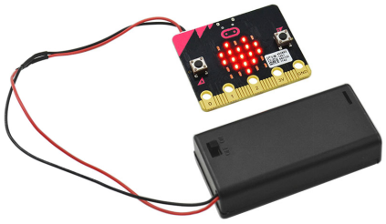

## 3.2 micro:bit Pins

Before getting started with the following projects, first need to figure out each pin of micro:bit main board. Please refer to the reference diagram shown below.

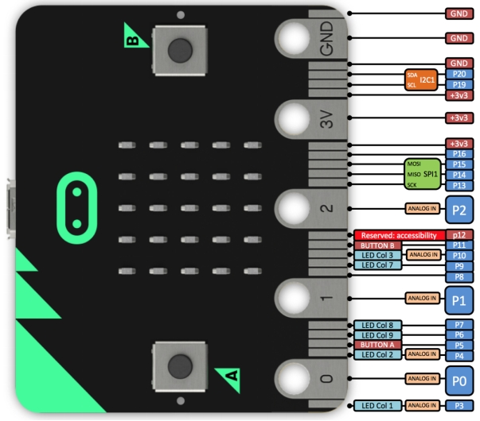

The BBC micro:bit has 25 external connections on the edge connector of the board, which we refer to as ‘pins’. The edge connector is the gray area on the right side of the figure below. 

There are five large pins, that are also connected to holes in the board labeled: 0, 1, 2, 3V, and GND. And along the same edge, there are 20 small pins that you can use when plugging the BBC micro:bit into an edge connector.

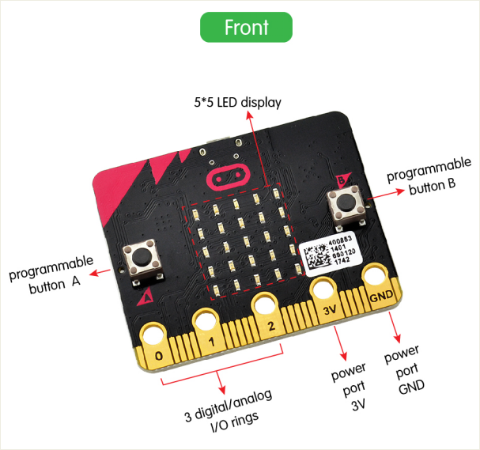

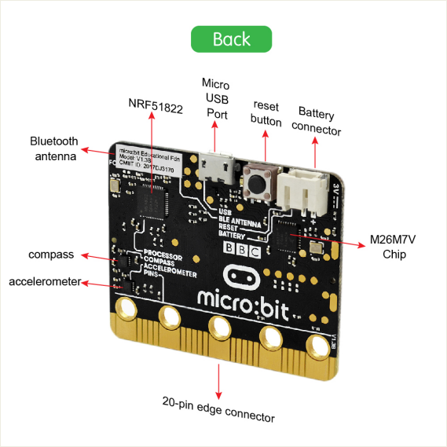

## 3.3 Learning Projects