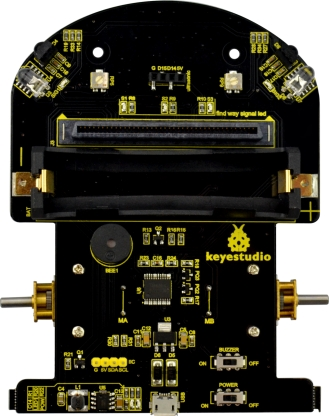
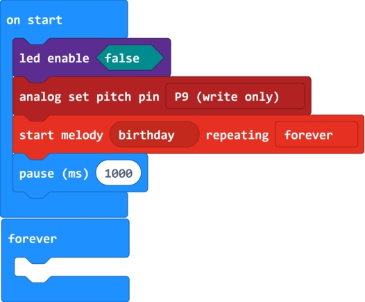

### Project 1 Playing Music

**1.Description**

Buzzers can be categorized as active and passive ones. The difference between the two is that an active buzzer has a built-in oscillating source, so it will generate a sound when electrified.

A passive buzzer does not have such a source, so DC signal cannot drive it beep. Instead, you need to use square waves whose frequency is between 2K and 5K to drive it. Different frequencies produce different sounds. You can use micro:bit to code the melody of a song, quite fun and simple.

The keyestudio Micro:bit robot shield comes with a passive buzzer element. The signal terminal of buzzer is connected to the P9 interface of micro:bit main board.

In the experiment, we make use of the software built-in library to drive the passive buzzer play a song of Happy Birthday.

**2.Test Code**

**3.Test Result**

Send well the test code to micro:bit main board, then insert the micro:bit main board into the micro:bit robot shield. Connect a 18650 battery to the shield, and turn the POWER and BUZZER switch ON.

You should hear the micro:bit robot shield playing a song of《Happy Birthday》