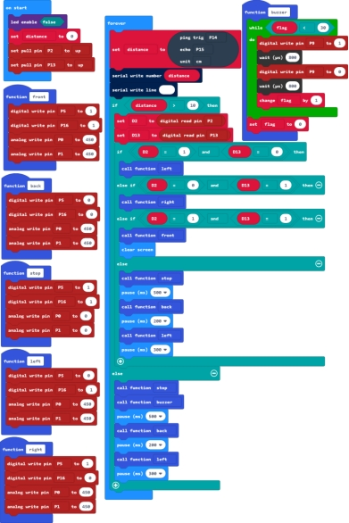

### Project 10 Ultrasonic and Infrared Avoiding Obstacles

**1.Description**

In the previous sections, we have introduced ultrasonic obstacle avoiding car and infrared obstacle avoiding car. To be more accurate, this lesson we combine both ultrasonic module and infrared obstacle detector sensors to build an obstacle avoiding car.

**2.Programming Thinking**

①When the distance between the car and front obstacle is less than or equal to 10cm, the robot car will stop, passive buzzer beeps for 0.5 second, mini car will go backward for 0.2 second, and then turn left for 0.3 second.

②When the distance between the car and front obstacle is greater than 10cm, use two infrared obstacle detector modules on the car shield to detect whether there is obstacles on the front left or on the front right.

- If detects an obstacle on the left side but not on the right side, the car will turn right.
- If detects an obstacle on the right side but not on the left side, the car will turn left.
- If detects no obstacle at both sides, the car will go forward.
- If detects obstacles at both sides, the car will stop, passive buzzer will beep for 0.5 second, then robot car goes backward for 0.2 second and then turns left for 0.3 second.

**3.Test Code**

**4.Test Result**

Send the test code to micro:bit main board, then insert the micro:bit main board into the car shield and connect a 18650 battery, turn the POWER switch ON. 

**①**When the front obstacle distance measured by ultrasonic sensor is greater than 10cm.

- If detects an obstacle on the left side but not on the right side, the car will turn right at a certain angle then go forward.
- If detects an obstacle on the right side but not on the left side, the car will turn left at a certain angle then go forward.
- If detects no obstacle at both sides, the car will go forward.
- If detects obstacles at both sides, the car will stop, passive buzzer will produce an audible beep, after 500ms, robot car goes backward, after 200ms, turns left at a certain angle and then goes forward.

**②**When the front obstacle distance measured by ultrasonic sensor is less than or equal to 10cm, the car will stop, passive buzzer will produce an audible beep, after 500ms, robot car goes backward, after 200ms, turns left at a certain angle and then goes forward.

