### Project 11 Bluetooth Test

**1.Description**

The micro:bit robot car shield comes with a Bluetooth module. We can use the built-in Bluetooth module to communicate with your phone’s APP, thus control the external devices connected to micro:bit control board using APP.

In the experiment, we only use the phone’s APP to control the LED matrix on the micro:bit main board, showing the different characters.

**(note that when controlled by Bluetooth, use leds show matrix drawing module, easy to crash.)**

**2.Library link settings**

The micro:bit robot car shield comes with a Bluetooth module.

Before sending the test code, we should add the library to micro:bit on the browser. The method is as below.

Connect the micro:bit main board to your computer using a USB cable.

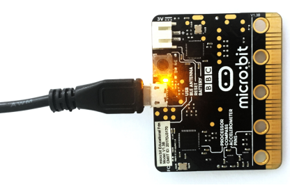

Open micro:bit MakeCode Block editor: https://makecode.microbit.org/#editor. Firstly click the Extensions.
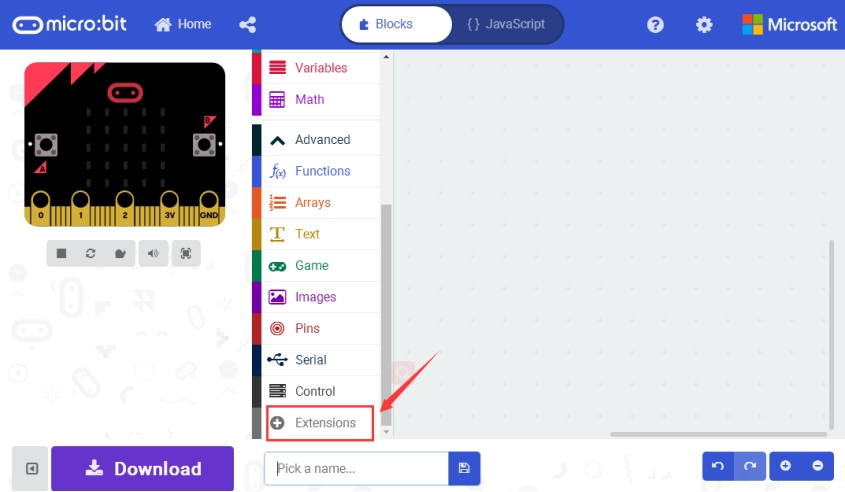

Then click the **Bluetooth**.

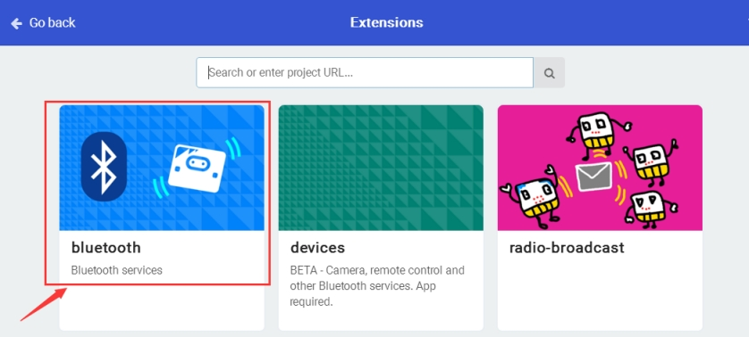

TAP Remove extensions and add Bluetooth.

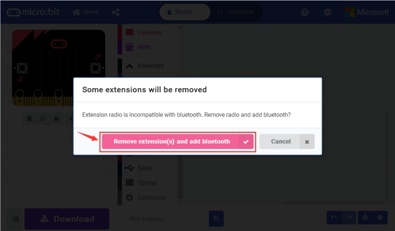

Finally, you should see the Bluetooth is added well.

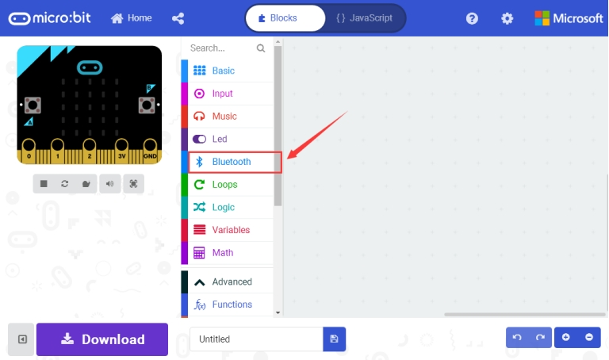

Then click the **Extensions** again, enter the library link below and search:
https://github.com/LaboratoryForPlayfulComputation/pxt-BlockyTalkyBLE-UART

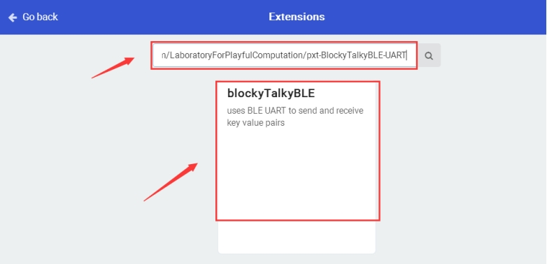

Finally, you should see the library **blocky Talky BLE** is added successfully.

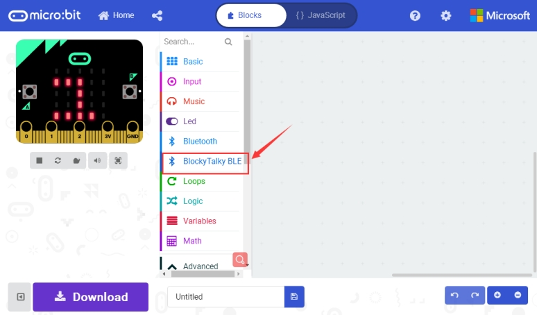

**3.Test Code**

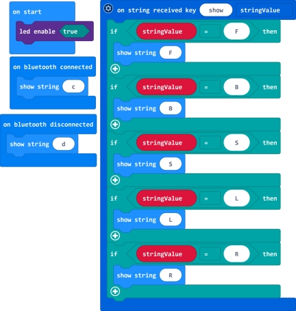

**4.Bluetooth APP Use**

After add the library and send the test code to micro:bit main board, power on the micro:bit main board.

Click the link to download the Bluetooth APP:
https://drive.google.com/open?id=17jJB--GKxPytDyPuqqhs6B2NUCCu7kST

Installed the APP, click the APP icon to open it.

When your phone detects the Bluetooth module on the micro:bit main board, the APP will prompt to open the Bluetooth. Choose to open the Bluetooth. Pop up the interface below.

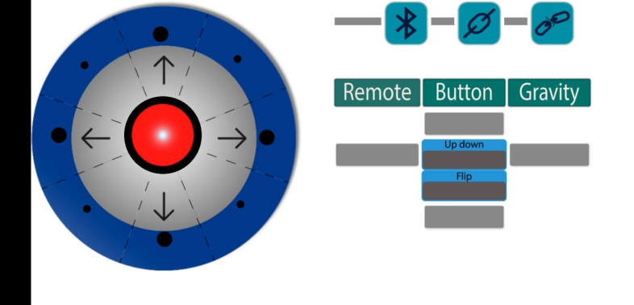

Then click the Bluetooth icon , it will pop up the micro:bit information.

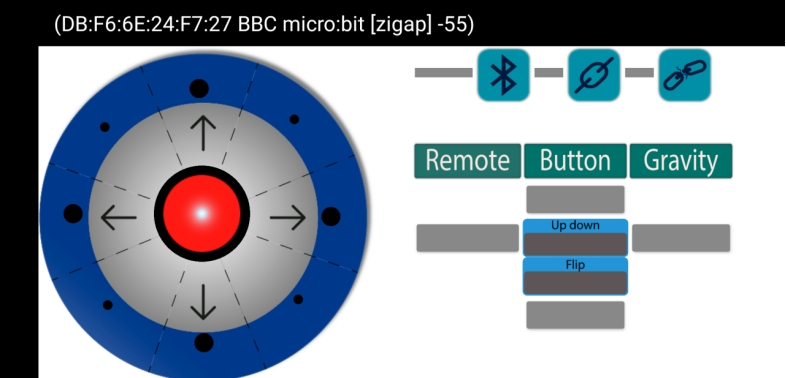

Then click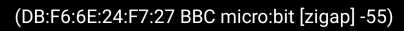to connect the micro:bit Bluetooth. 

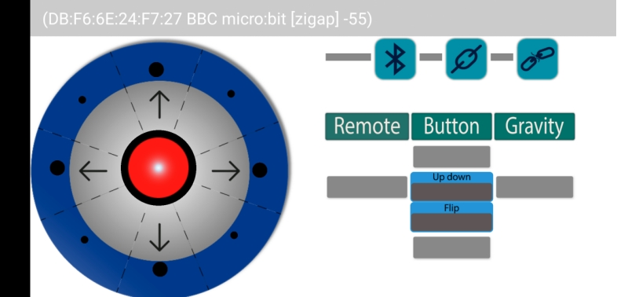

After that, clickfor connection, pop up the interface shown below.

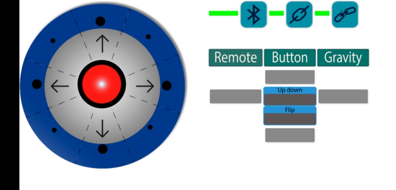

Here the Bluetooth is connected successfully, you can use the APP to control your micro:bit car. The options are shown on the right side.

You can click theto disconnect the Bluetooth. Shown below.

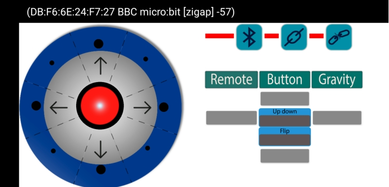

**5.Test Result**

Send well the test code to micro:bit main board, and power on the micro:bit main board. Follow the method mentioned above, connect the Bluetooth on the micro:bit main board using your phone’s APP.

Connected, click the right icons on the APP, the LED matrix on the micro:bit main board should show different letters.

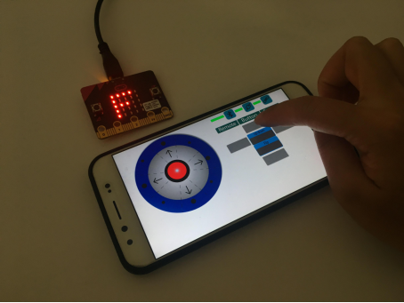

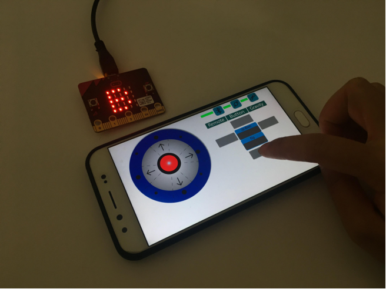