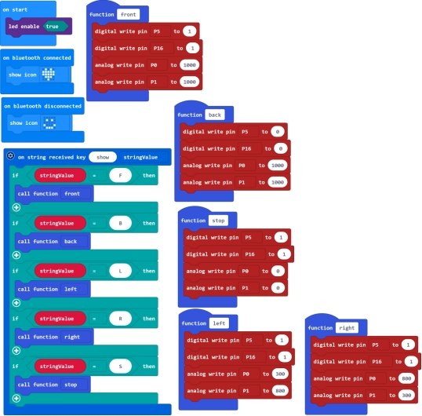
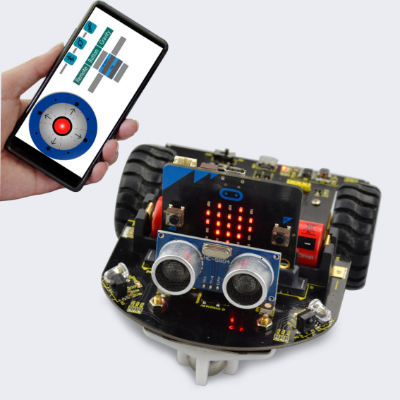

### Project 12 Bluetooth Controlled Car

**1.Description**

In the previous projects, we have combined the sensors and robot shield to make the specific function car. In this project, we use the shield’s motor driving circuit and Bluetooth module to build a Bluetooth controlling car.

**2.How does it work?**

Connect well the Bluetooth module using phone’s APP, when the Bluetooth module receives the characters sent by APP, it will control the motion state of robot car based on the received data.

**3.Programming Thinking**

**①**When your phone’s APP is connected to Bluetooth module, the built-in LED matrix on the micro:bit main board should show the heart shape. If connection failed, it will show a smile face.

**②**Bluetooth connected, click front, the APP will send the char “F”, controlling the car forward; if click back, it will send the char “B”, controlling the car backward; if click left, it will send the char “L”, controlling the car turn left; if click right, it will send the char “R”, controlling the car turn right; if click stop, it will send the char “S”, controlling the car stop.

**4.Test Code**

**5.Test Result**

Send the test code to micro:bit main board, then insert the micro:bit main board into the car shield and connect a 18650 battery, turn the POWER switch ON.

When your phone’s APP is connected to Bluetooth module, the built-in LED matrix on the micro:bit main board should show the heart shape. If connection failed, it will show a smile face.

Bluetooth connected, you should be able to control the movement of micro:bit robot car using APP.

