### Project 13 Wireless Gamepad Control

**1.Description**

Apart from the Android APP controlling Bluetooth mentioned above, you can also control the micro:bit through IOS Bluetooth wireless programming and control.

**2.Test Code**

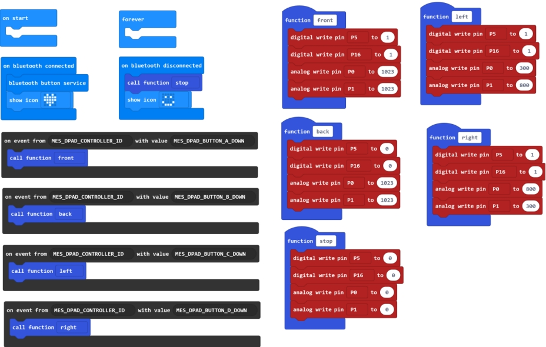

**Pay close attention to: **When open the MakeCode Editor, click the icon, select the project settings, shown below.

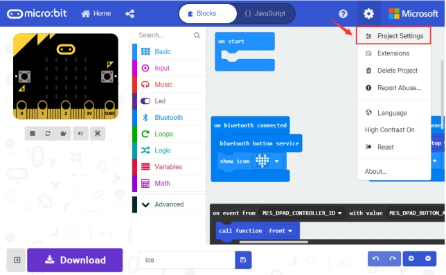

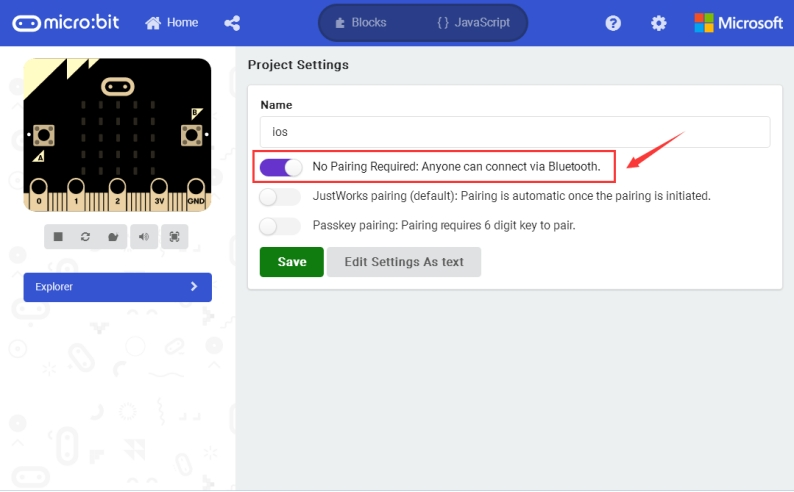

**3.How to control the car through IOS Bluetooth programming?**

**Step 1:** Open the App store on your ipad/iPhone.

**Step 2:** Search the micro:bit to download and install.

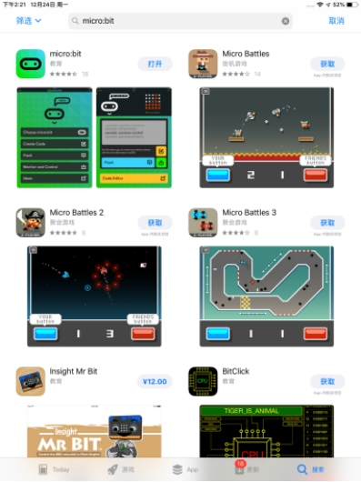

**Step 3:** open the micro:bit interface, click **Choose micro:bit**.

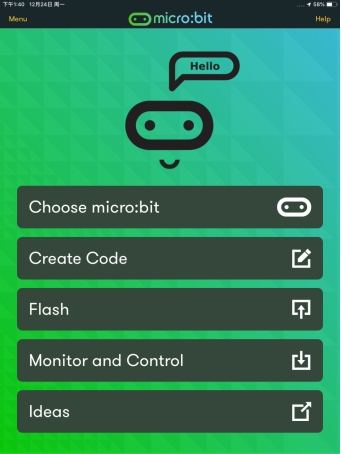

Then click **Pair a micro:bit**, and click **Next**.

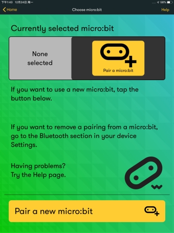

**Step 4:** power on the micro:bit main board, HOLD the A and B buttons, then press and release RESET button. The micro:bit main board will enter the Bluetooth pairing mode. 

You should see an image showing on the LED matrix.

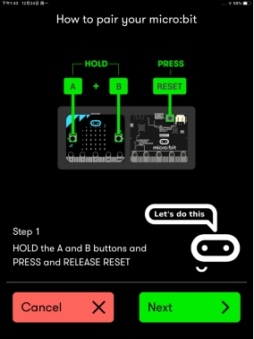

**Step 5:** copy the pattern from your micro:bit device and tap **Next**. 

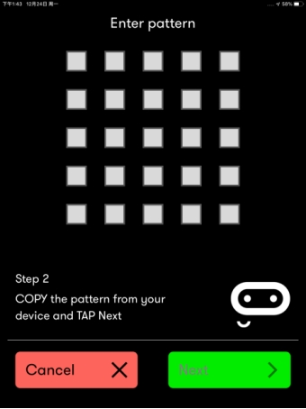

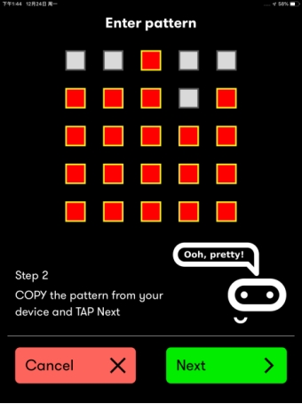

Continue to tap **Next** to pair. 

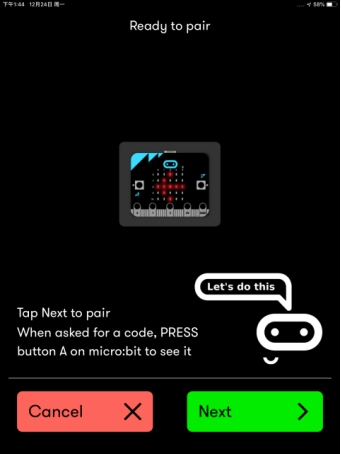

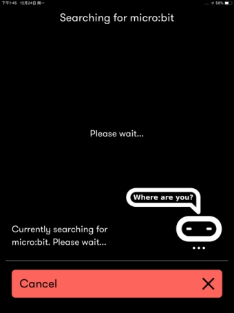

OK, pairing successful!

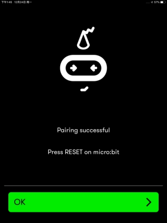

**4.How to control your micro:bit car using the Bluetooth?**

**Step 1:** press down the RESET button on the micro:bit main board. Then TAP the **Monitor and Control** on the APP interface.

**Step 2:** Tap the **Add** and then select the **Gamepad**.

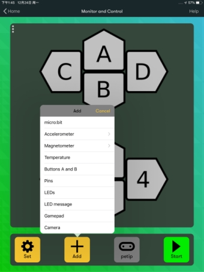

And you should see the control interface shown below. Click **Start** to connect.

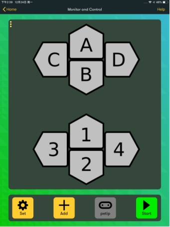

Connection successful! Click **Stop** to disconnect.

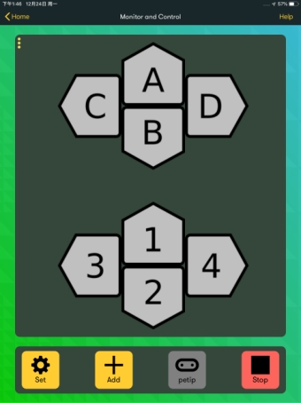

**5.Test Result**

When you press the key **A**, the micro:bit car goes front; press the key **B**, go back; press the key **C**, turn left; press the key **D**, turn right; press **Stop**, disconnect the Bluetooth, the car will stop.

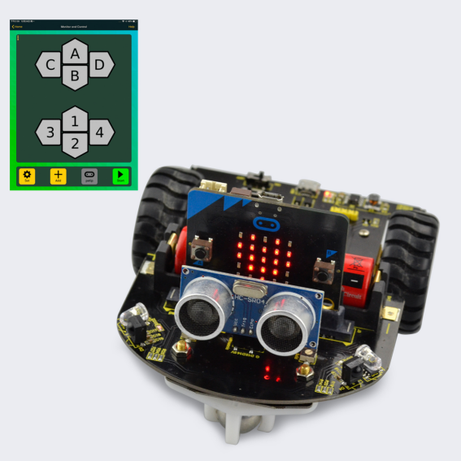

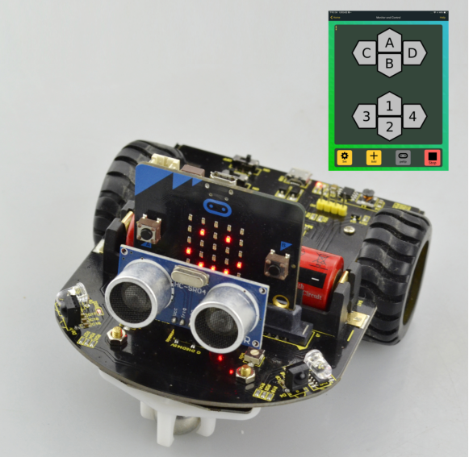