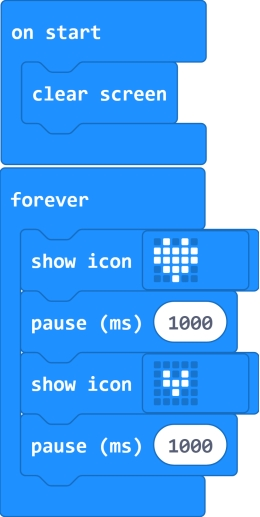
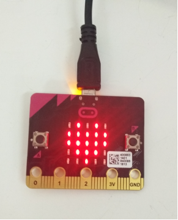
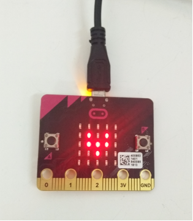

### Project 2 Micro:bit LED Matrix Display

**1.Description**

LED stands for Light Emitting Diode. The micro:bit has 25 individually-programmable LEDs, allowing you to display text, numbers, and images.

The micro:bit MakeCode Block editor has built-in library. So you can use it to control the 25 LED lights on and off, showing the different images.

In the experiment, we drive the 25 LED lights show a big heart and a small heart images.

**2.Test Code**

**3.Test Result**

Send well the test code to micro:bit main board, powered on, the micro:bit 25 LED lights show a big heart for one second, then show a small heart image for one second, repeatedly. 

