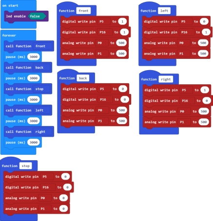

### Project 3 Motor Driving

**1.Description**

The micro:bit robot shield has a built-in TB6612FNG chip. When using, you just need to insert the micro:bit main board into the shield, and send the test code to micro:bit main board. Insert well the 18650 battery into the shield to control the two motors rotate, thus control the micro:bit car run.

**2.Below is a table of TB6612FNG chip pins (PWM range of 0~1023)**

| Car state  | Left motor control pin (P5) state | PWM(P0) | Left motor  | Right motor control pin(P16) state | PWM(P1) | Right motor |
| ---------- | --------------------------------- | ------- | ----------- | ---------------------------------- | ------- | ----------- |
| Forward    | 1                                 | 500     | Go forward  | 1                                  | 500     | Go forward  |
| Backward   | 0                                 | 500     | Go backward | 0                                  | 500     | Go backward |
| Stop       | 0                                 | 0       | Stop        | 0                                  | 0       | Stop        |
| Turn left  | 0                                 | 500     | Go backward | 1                                  | 500     | Go forward  |
| Turn right | 1                                 | 500     | Go forward  | 0                                  | 500     | Go backward |

**3.Test Code**

**4.Test Result**
Send well the test code to micro:bit main board, then insert the micro:bit main board into the car shield, and connect a 18650 battery into the car shield.

Turn the POWER switch ON. The micro:bit car will go forward for 3 seconds, backward for 3 seconds, stop for 3 seconds, turn left for 3 seconds and turn right for 3 seconds, repeatedly.