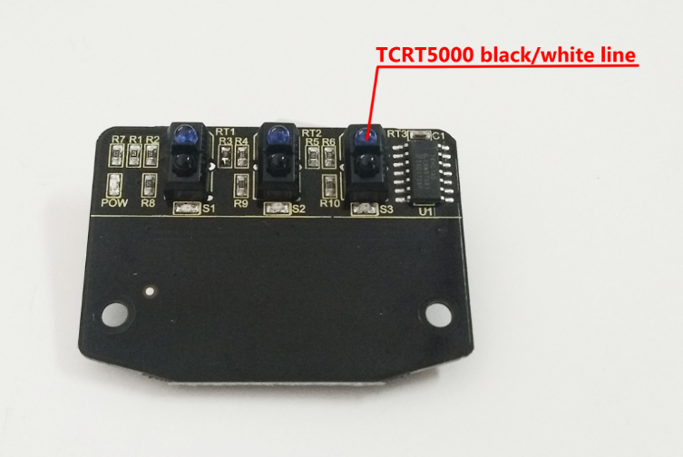
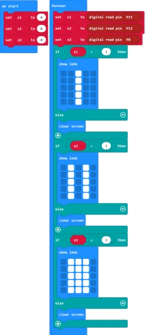
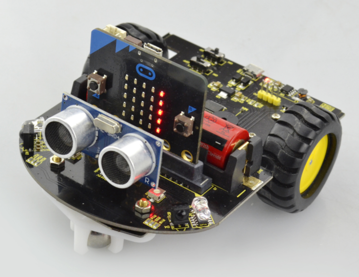
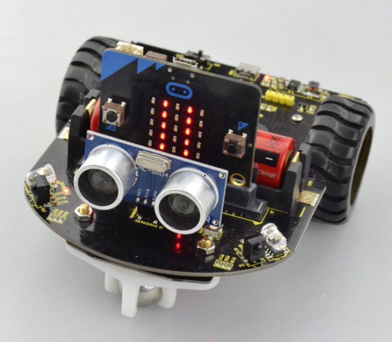
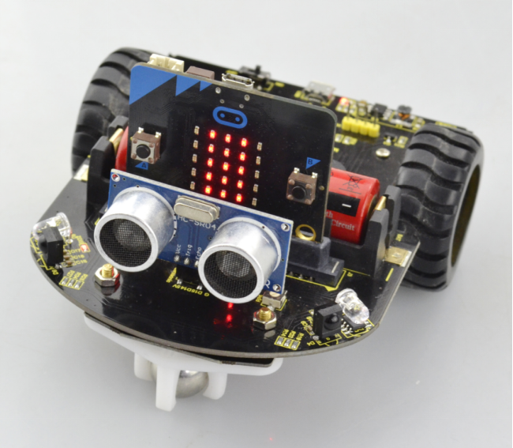

### Project 4 Test the tracking sensor

**1.Description**

The tracking sensor is actually an infrared sensor. The component used here is the TCRT5000 infrared tube.

Its working principle is to use the different reflectivity of infrared light to the color, then convert the strength of the reflected signal into a current signal. During the process of detection, black is active at LOW level, but white is active at High level.

The following picture is our keyestudio line tracking sensor designed for Micro:bit robot car. We have integrated 3 sets of TCRT5000 infrared tube on a single board, pretty convenient for wiring and controlling.

**2.TECH SPECS**

- Operating Voltage: 3.3-5V（DC）
- Interface: 5Pin connector
- Output Signal: digital signal

**3.Test Code**

**4.Test Result**

Send the test code to micro:bit main board, then insert the micro:bit main board into the car shield and connect a 18650 battery, turn the POWER switch ON. At this moment, the micro:bit LED matric has no display.

But if approach your finger to the first tracking sensor (S1), the LED matrix will show **Ⅰ** in the middle;

Approach your finger to the second tracking sensor (S2), the LED matrix will show **Ⅱ**;

Approach your finger to the third tracking sensor (S3), the LED matrix will show **Ⅲ**;

