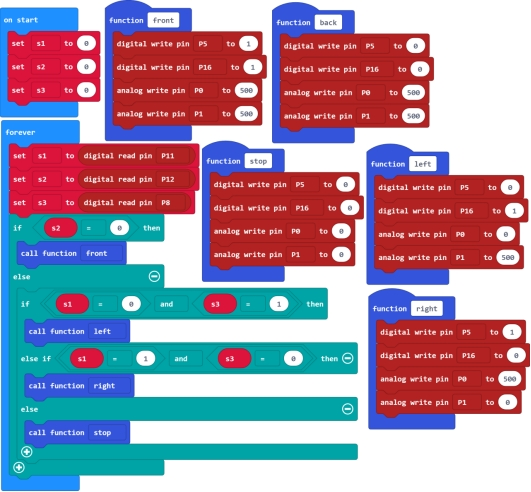
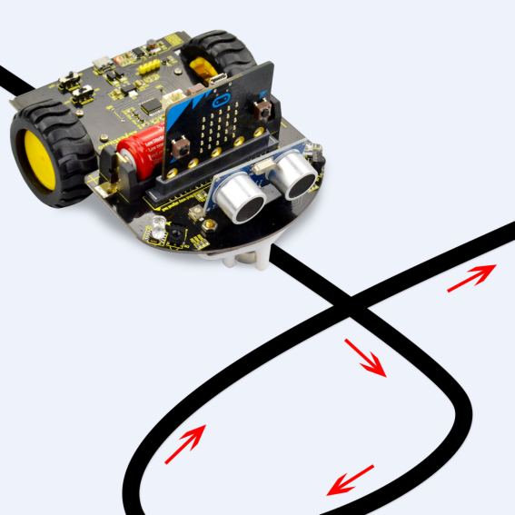

### Project 5 Line Tracking Car

**1.Description**

In the previous section, we have introduced the principle and application of line tracking module and motor driving. After that, combine the tracking sensor and module to build a line following car.

So at first what does line tracking mean? It refers to follow the line trajectory. You might often see some robots always follow or track a black line.

**2.How does it work?**

It uses the tracking sensor to detect the black track on the pavement, and detection signal will feed back to the micro:bit main board. Then micro:bit main board will analyze and judge the collected signals to control and drive the motor in time, thus can adjust the car’s turning direction.

That is why the micro:bit car can automatically follow the black track, achieving the automatic line tracking function.

**3.Programming Thinking**

①At first judge the middle tracking sensor. If it detects a black line, no matter detect a black line on either side, the micro:bit car always goes forward. 

②If the middle tracking sensor does not detect a black line, then judge the sensor on both sides.

If the left sensor detects a black line, but the right sensor doesn’t, the micro:bit car will turn left;

If the right sensor detects a black line, but the left sensor doesn’t, the micro:bit car will turn right;

If all three sensors do not detect a black line, the micro:bit car will stop.

**4.Test Code**

**5.Test Result**

Send the test code to micro:bit main board, then insert the micro:bit main board into the car shield and connect a 18650 battery, turn the POWER switch ON. At this moment, the micro:bit mini robot car will follow a black line.

**Special Note:**When testing the car, do not test it under the sun. During the test, if go wrong, you can try to test it in a darker environment.

