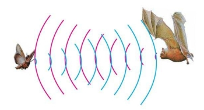
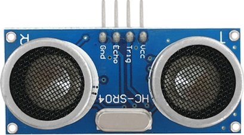
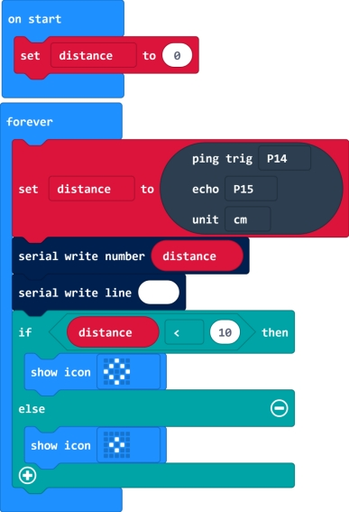
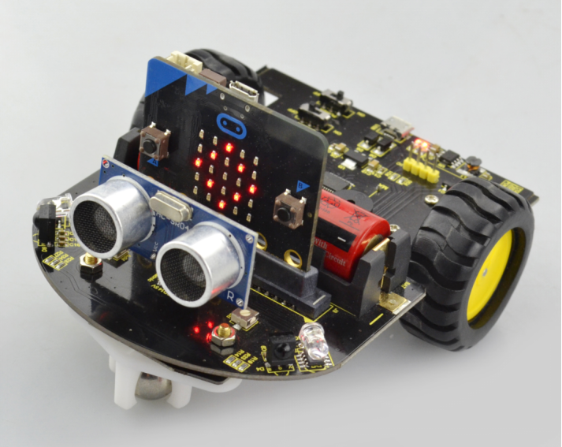
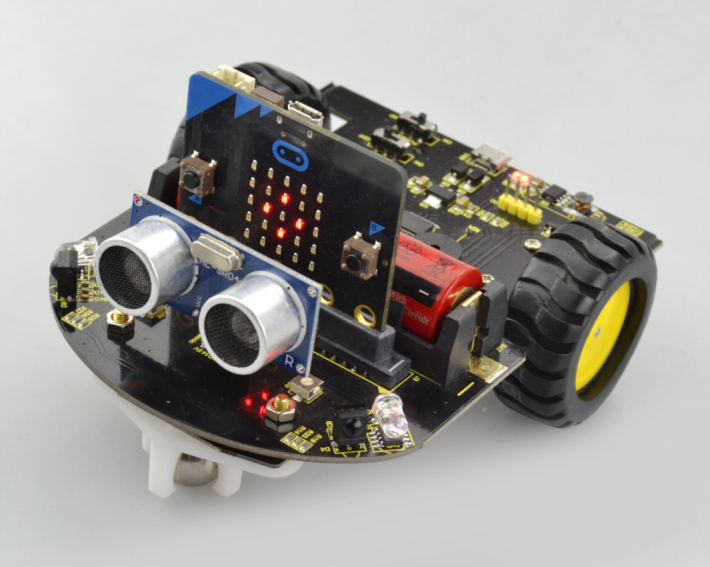

### Project 6 Ultrasonic Ranging

**1.Description**

There is an animal called bat in nature. The bats can fly at night, not depend on its eyes, but on its ears and vocal organs. When the bat flies, it will emit a scream, an ultrasonic signal that humans cannot hear because of its high audio frequency. If these ultrasonic signals hit other objects on the flight path, they will be reflected back immediately. After receive the returned information, the bats complete the whole process of listening, seeing, calculating and bypassing obstacles during the flutter.

The principle of the ultrasonic module is as the same as the above principle.The ultrasonic module will emit the ultrasonic waves after trigger signal. When the ultrasonic waves encounter the object and are reflected back, the ultrasonic module outputs an echo signal, so it can determine the distance of object from the time difference between trigger signal and echo signal.

Ultrasonic sensor has a wide range of sensitivity, no blind area, and no interference with obstacles. As the following picture shown, it is our keyestudio ultrasonic module. It has two somethings like eyes. One is transmitting end, the other is receiving end.

**2.TECH SPECS**

- Operating Voltage: 5V（DC）
- Operating Current: 15mA
- Operating Frequency: 40khz
- Maximum Detection Distance: 3-5m
- Minimum Detection Distance: 3-4cm
- Sensing Angle: less than 15 degrees

**3.Test Code**

**4.Test Result**

Send the test code to micro:bit main board, then insert the micro:bit main board into the car shield and connect a 18650 battery, turn the POWER switch ON.

At this moment, when the micro:bit mini robot car detects an obstacle ahead, the measured result will be showed on the micro:bit LED matrix.

If the measured distance between an obstacle and ultrasonic module is less than 10cm, the micro:bit LED matrix will show a big prismatic image;

If the measured distance is greater than 10cm, the micro:bit LED matrix will show a small prismatic image.

