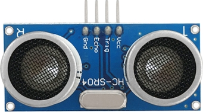
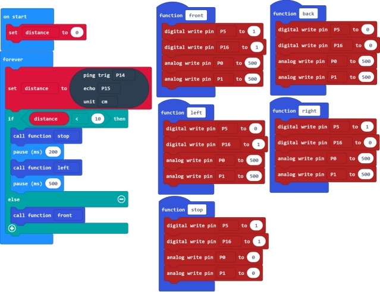
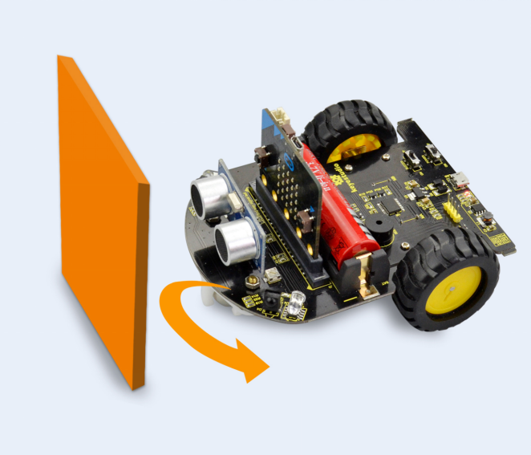

### Project 7 Ultrasonic Obstacle Avoiding Car

**1.Description**

In the previous project, we have combined a tracking sensor and micro:bit car shield to build a line tracking car.

Here we combine a ultrasonic module and micro:bit car shield to build an ultrasonic obstacle avoiding car.

How does it work?

We have introduced the principle of ultrasonic module before. We can use a ultrasonic module to measure the distance between the micro:bit car and an obstacle ahead. Then control the running state of micro:bit robot car according to the measured distance.

**2.Programming Thinking**

①At first, use a ultrasonic module to measure the distance between the micro:bit car and an obstacle ahead.

②When the measured distance is less than 10cm, the micro:bit car stops for 0.2 second, then turns left for 0.5 second and then goes forward. If the measured distance is greater than or equal to 10cm, the micro:bit car will directly go forward.

**3.Test Code**

**4.Test Result**

Send the test code to micro:bit main board, then insert the micro:bit main board into the car shield and connect a 18650 battery, turn the POWER switch ON.

At this moment, if the micro:bit robot car encounters an obstacle ahead, it will turn left to a certain angle, then go forward.

