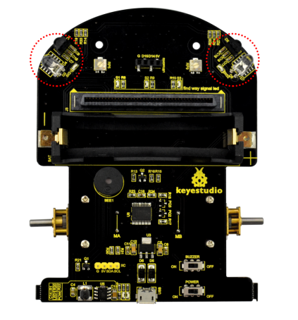
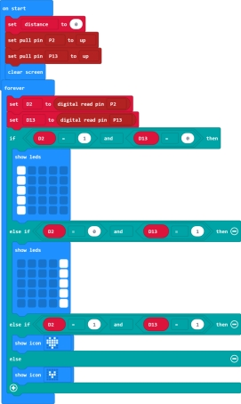
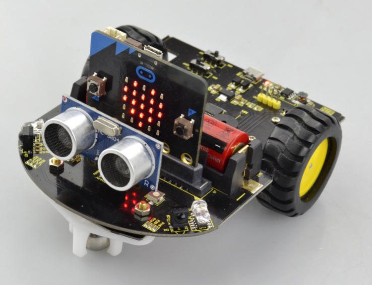
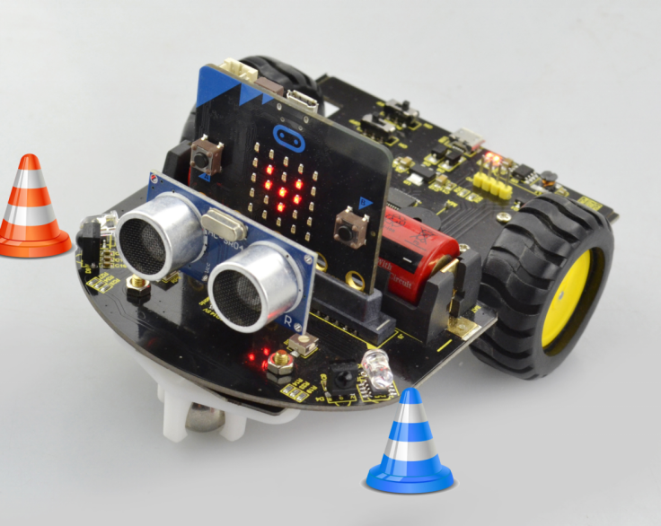
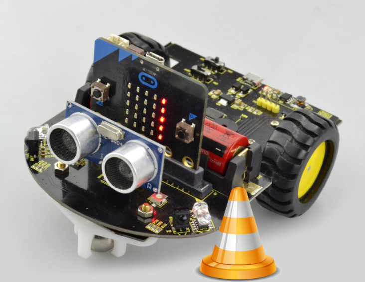
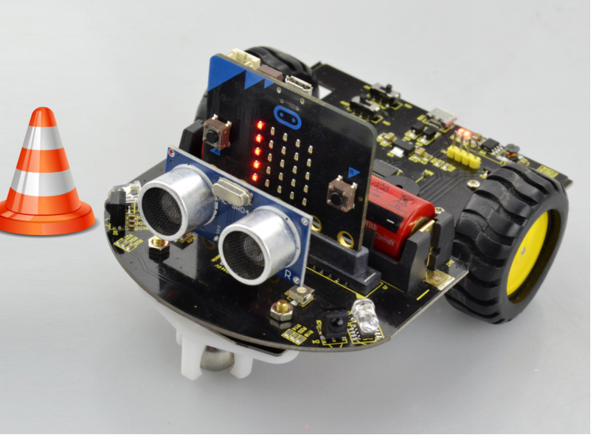

### Project 8 Infrared Detection

**1.Description**

The micro:bit robot car shield comes with two infrared obstacle detector sensors. It is actually designed for infrared obstacle avoidance robot.

The infrared obstacle detector sensor has a pair of infrared transmitting and receiving tubes.The transmitter emits an infrared rays of a certain frequency. When the detection direction encounters an obstacle (reflecting surface), the infrared rays are reflected back, and receiving tube will receive it.

At this time, the indicator (SIG1/SIG2 LED) lights up. After processed by the circuit, the signal output terminal will output Digital signal.

You can rotate the potentiometer on the shield to adjust the detection distance. It is better to adjust the potentiometer to make the SIG1/SIG2 LED in a state between on and off. The detection distance is the best, almost 10cm.

**2.Test Code**

**3.Test Result**

Send the test code to micro:bit main board, then insert the micro:bit main board into the car shield and connect a 18650 battery, turn the POWER switch ON.

The two infrared obstacle detector sensors on the micro:bit mini robot car can used to detect an obstacle ahead.

- If the infrared sensors on both side do not detect an obstacle, the LED matrix will show a big heart image.
- If the infrared sensors on both side detect an obstacle, the LED matrix will show a small heart image.
- If the left infrared sensor detects an obstacle, but the right sensor doesn’t, the left column of LED matrix will light up.
- If the right infrared sensor detects an obstacle, but the left sensor doesn’t, the right column of LED matrix will light up.

