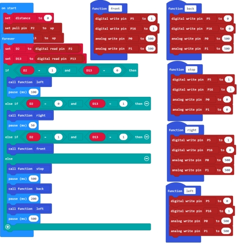

### Project 9 Infrared Obstacle Avoiding Car

**1.Description**

In the previous project, we have combined sensor and micro:bit car shield to build a specific function car.
Now, we use an infrared obstacle detector module and motor driving circuit on the micro:bit car shield to build an infrared obstacle avoiding car.

**2.How does it work?**

We have introduced the principle of infrared obstacle detector module before. We can make use of two infrared obstacle detector modules integrated on the car shield to detect whether have obstacles on the both sides of micro:bit car. Thus control the car’s running state according to the testing interface.

**3.Programming Thinking**

①If detects an obstacle on the left side but not on the right side, the car will turn right for 0.05 second.

②If detects an obstacle on the right side but not on the left side, the car will turn left for 0.1 second.

③If detects no obstacle at both sides, the car will go forward.

④If detects obstacles at both sides, the car will stop for 0.5 second, then go backward for 0.2 second and then turn left for 0.5 second.

**4.Test Code**

**5.Test Result**

Send the test code to micro:bit main board, then insert the micro:bit main board into the car shield and connect a 18650 battery, turn the POWER switch ON.

The left infrared sensor on the car shield detects an obstacle, the car will turn right at a certain angle and then go forward.

The right infrared sensor on the car shield detects an obstacle, the car will turn left at a certain angle and then go forward.

If both of them detect no obstacle, the car will go forward. If both of them detect obstacles, the car will stop, then go backward, turn left at a certain angle and then go forward.