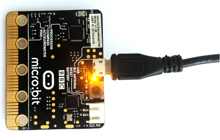
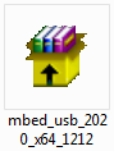
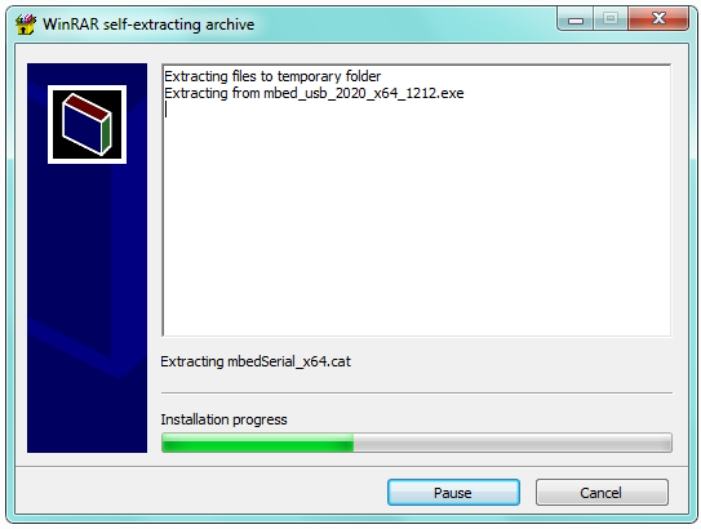
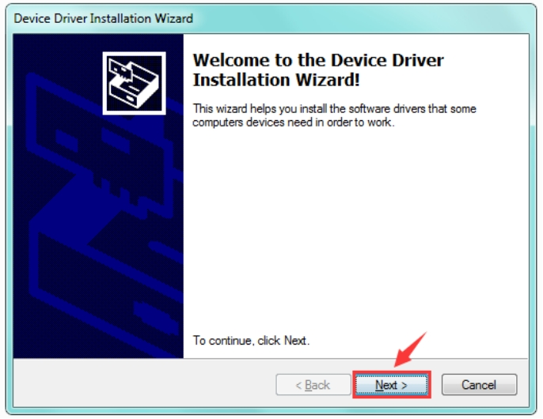
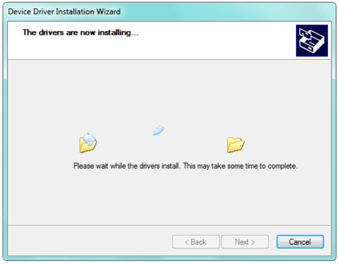
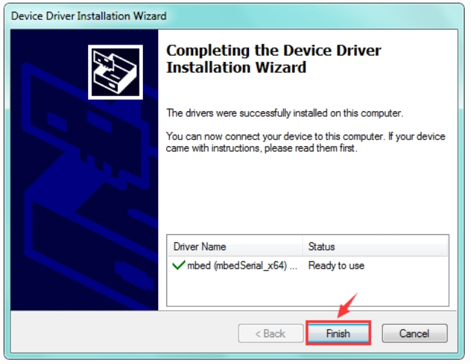
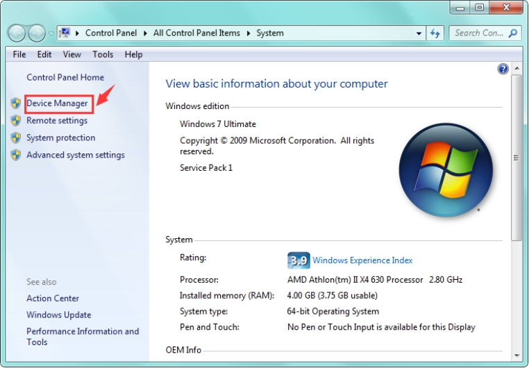
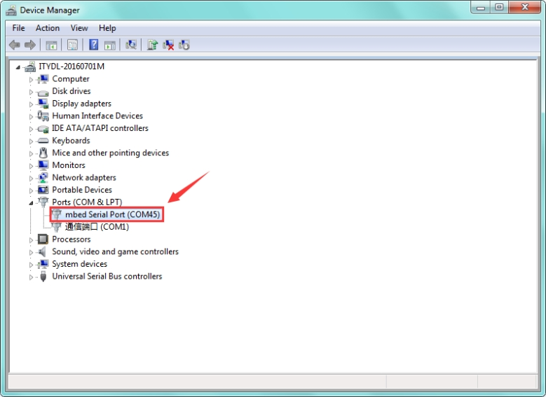

# 4. Driver installation

1.Next, let’s install the driver for micro:bit main board.First of all, connect the micro:bit to your computer using a USB cable.

2.**Please download the driver software： [Driver](./Driver.7z)**

Click the icon to install after the download is complete.

3.After that, click Next to continue the installation.

4.Wait the driver installing finished.

5.Wait the driver installing finished.

6.Driver installation completed, then you can right click the “Computer” —> “Properties”—> “Device Manager”.

You can check the detailed Ports information shown as below.

